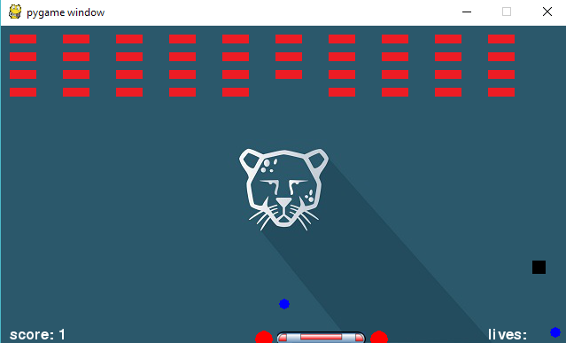

# Hit_Brick game

### Introduction

This is a sample ping-pong ball game build by [pygame][pygame]

### How to run it

```python
cd src
pip install -r requirements.txt
python main.py
```

### Snapshot



### License

MIT: [http://rem.mit-license.org](http://rem.mit-license.org)

### Useful links

- [pygame][pygame]
- [pygame-GettingStarted][pygame-GettingStarted]

[pygame]: https://www.pygame.org
[pygame-GettingStarted]: https://www.pygame.org/wiki/GettingStarted