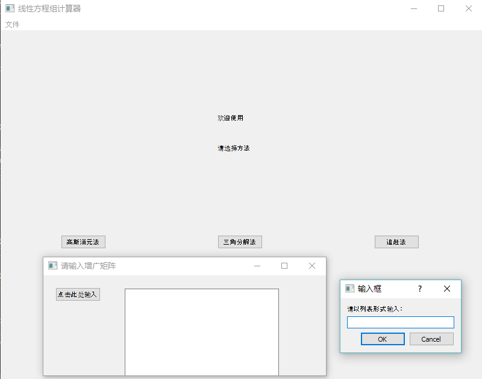

# Calculator of linear equations

### Introduction

This is a simple calculator of linear equations build by [PyQt5][PyQt5], [numpy][numpy].

### How to run it

```python
cd src
pip install -r requirements.txt
python code.py
```

### Snapshot



### License

MIT: [http://rem.mit-license.org](http://rem.mit-license.org)

### Useful links

- [PyQt5][PyQt5]
- [numpy][numpy]

[PyQt5]: https://www.riverbankcomputing.com/software/pyqt/intro
[numpy]: http://www.numpy.org/