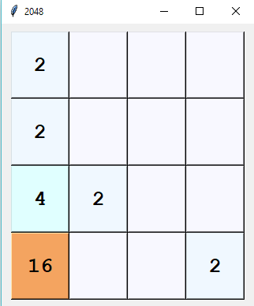

# 2048 tkinter game

### Introduction

This is a sample 2048 game build by [tkinter][tkinter]

### How to run it

```python
cd src
python Tkinter2048.pyw
```

### Snapshot



### License

MIT: [http://rem.mit-license.org](http://rem.mit-license.org)

### Useful links

- [tkinter][tkinter]
- [tkinter — Python interface to Tcl/Tk][tkinter — Python interface to Tcl/Tk]

[tkinter]: https://wiki.python.org/moin/TkInter
[tkinter — Python interface to Tcl/Tk]: https://docs.python.org/3/library/tkinter.html