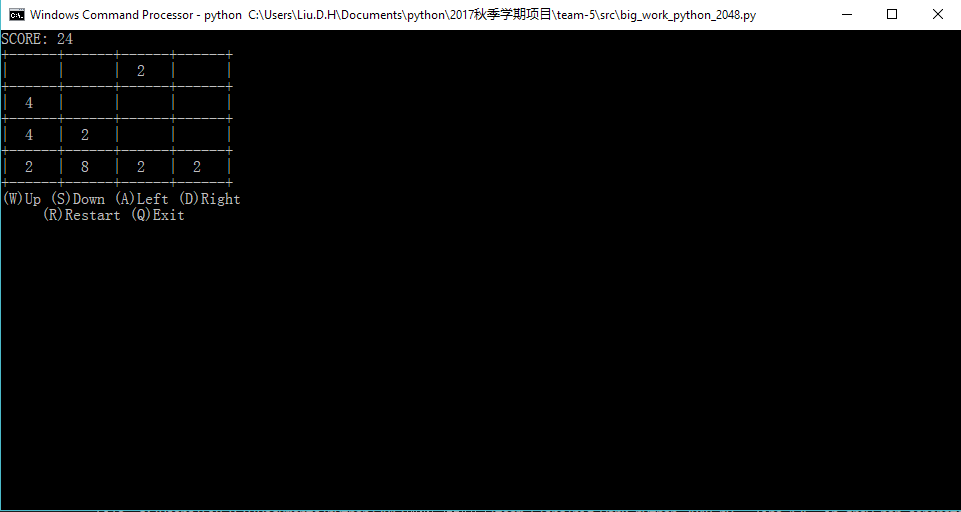

# 2048 terminal game

### Introduction

This is a 2048 game of terminal version build by [curses][curses]

curses library may be ran with `ImportError: No module named '_curses'` error. see [ImportError: No module named '_curses' when trying to import blessings][ImportError: No module named '_curses' when trying to import blessings].

### How to run it

```python
cd src
pip install -r requirements.txt
python big_work_python_2048.py
```

### Snapshot



### License

MIT: [http://rem.mit-license.org](http://rem.mit-license.org)

### Useful links

- [curses][curses]
- [ImportError: No module named '_curses' when trying to import blessings][ImportError: No module named '_curses' when trying to import blessings]

[curses]: https://docs.python.org/3/howto/curses.html
[ImportError: No module named '_curses' when trying to import blessings]: https://stackoverflow.com/questions/35850362/importerror-no-module-named-curses-when-trying-to-import-blessings