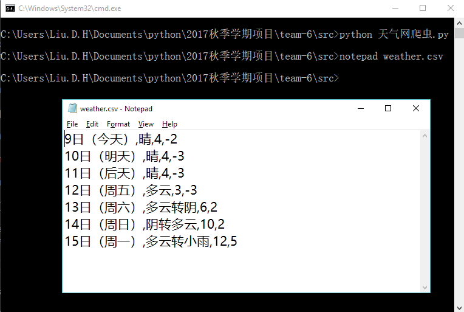

# Weather forecast application

### Introduction

This is a simple weather forecast application built on [requests][requests], [BeautifulSoup][BeautifulSoup].

### How to run it

```python
cd src
pip install -r requirements.txt
python 天气网爬虫.py
```

### Snapshot



### License

MIT: [http://rem.mit-license.org](http://rem.mit-license.org)

### Useful links

- [requests][requests]
- [BeautifulSoup][BeautifulSoup]

[requests]: http://docs.python-requests.org/en/master/
[BeautifulSoup]: https://www.crummy.com/software/BeautifulSoup/